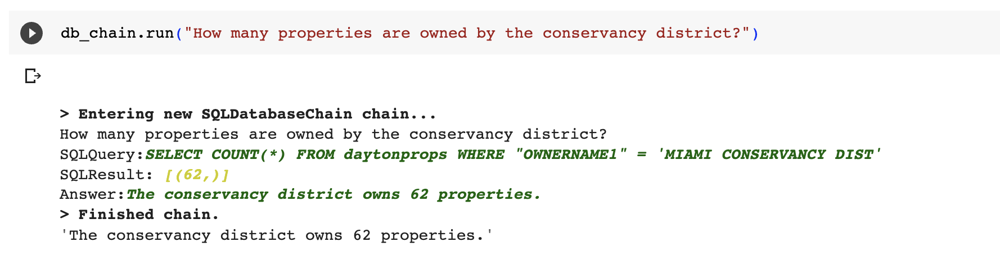
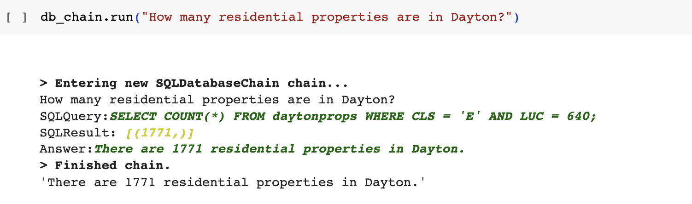

# MontyBot experiments #

Experimenting with using [LangChain](https://python.langchain.com/en/latest/modules/chains/examples/sqlite.html) to provide natural language queries against the county parcel data.



## Setup ##

As with a lot of projects, a fair portion of the work here is cleaning and preparing the data.

We are starting with two of our standard data files, the monthly taxroll.csv [from here](http://www.mctreas.org/mctreas/fdpopup.cfm?dtype=TR) file and the GIS group's Parcel Shapefile [here](http://www.mcauditor.org/downloads/Shape_files/SHAPEFILES_PARCELLINES_ROW_OLDLOT.zip). Neither file is included in the repo due to their size.

### Step 1: Generate the centroid file ###

The parcel shapefile contains the polygon outline of all parcels in the county. This is useful for some projects (like our Plume Data mapping, [last month](https://www.codefordayton.org/2023/05/03/qgis-plume.html)), but is overkill if you just want to drop a pin on the map.

The `init_parcel_centroid.py` script iterates over the polygons in the shapefile and computes the centerpoint (or centroid) of the polygon, and writes it, along with the parcel id, to a dbm file. There is an additional prep step described in the `init_parcel_centroid.py` script to convert the shapefile into the appropiriate coordinate system. If you don't do this, you'll get screwy coordinates.

ogr2ogr is part of the [GDAL toolset](https://gdal.org/index.html).

```
ogr2ogr -t_srs EPSG:4326 out.shp PARCELS.SHP
python init_parcel_centroid.py out.shp
```

This step _could_ also be done entirely within QGIS, if you'd prefer a GUI.

### Step 2: Prep the taxroll csv file ###

To make the data easier to work with, I removed non-Dayton parcels from the file. You can use either version, but just Dayton makes everything move quicker.

`clean_csv.py` removes a handful of fields from the csv file, makes the fields variable width, and adds latitute and longitude from the centroid file to each record. The output is written to another csv file.

_Why modify the csv file?_ LangChain provides the table schema and sample rows to the LLM, so longer data means pricier queries. The removed fields weren't relevant to the experiment. If they are relevant to your use case, it is straightforward to modify the list of removed fields.

```
python clean_csv.py taxroll.csv centroids.dbm
```

### Step 3: Create the database ###

I think [datasette](https://datasette.io/) is magic. The tool comes with several utilities that make working with sql databases easier. One of the most handy for us is [csvs-to-sqlite](https://datasette.io/tools/csvs-to-sqlite), which does exactly what you'd expect. Feed it a csv file and it will create a sqlite database with the same data, and using the same field types.

```
csvs-to-sqlite daytonprops.csv out.db 
```

### Step 4: Get an OpenAI API key ###

LangChain can use lots of different LLMs. OpenAI is the easiest to get started with. Signing up for an account & getting the key is straightforward, but there are [guides](https://www.youtube.com/watch?v=Ay0u4O6PoBE) available if you'd prefer to check your work.

_How much is this going to cost?_ Good question. I spent about ~$1.25 in 30 or so queries. Not bad, but it can add up if you test a lot. *Set a low Hard and Soft Limit for yourself to keep from overdoing it.*

### Step 5: Enter the LangChain ###

We are going to follow the [LangChain SQLite example](https://python.langchain.com/en/latest/modules/chains/examples/sqlite.html) fairly closely. The `MontyBot.ipynb` file goes through the steps.

## Next Steps ##

More context is clearly needed. I'd recommend trimming down the fields more and adding custom context for some of the fields, like Class and Land Use Code. Land Use Code may benefit from a separate table that spells out each value.

After that is complete, look at testing more and investigating deployment options.


_This is a bad query. The LLM is lacking context on the LUC and Class fields._